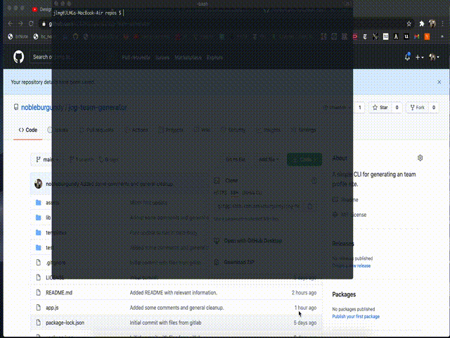

# Team Profile Generator

    

## Table of Contents

- [Installation](#installation)
- [Usage](#usage)
- [Credits](#credits)
- [License](#license)
- [Contributing](#contributing)
- [Tests](#tests)

## Description

A command line application that allows you to quickly create a team and display relevant information on a website.

## Installation

1. Clone the repo.
2. `cd` into the project folder.
3. Run `npm install`.

## Usage

Once you have cloned the repo, run the following from the root of the project...

1. `node app.js`
2. Follow the prompts to add employee profiles to your team. When you've added the last employee, the html file will be writen to the `{project root}\output\team.html` file.

### Demo

A link to the full demo video can be found [here](https://drive.google.com/file/d/1QwfZP3LBmE0h43CfmmIIsVW0ofoGZOdI/view?usp=sharing).

## Credits

The `Inquirer` package and it's documentation was used extensively for this project.

- [NPM](https://www.npmjs.com/package/inquirer)
- [GitHub](https://github.com/SBoudrias/Inquirer.js)
- [Examples](https://github.com/SBoudrias/Inquirer.js/tree/master/packages/inquirer/examples)

## License

Licensed under the MIT license.

## Contributing

Contributions are welcome. If you are interested in contributing to this project, please open a pull request. Bug fixes, feature requests, and documentation updates/fixes are all encouraged.

## Tests

From the project root, run `npm run test`.

## Questions?

Please contact me via email at goul0076@gmail.com with any questions.
